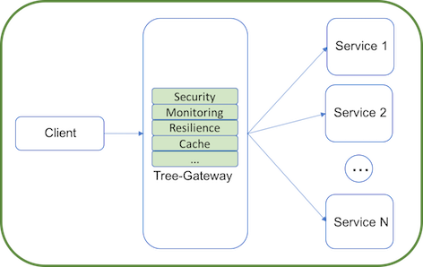
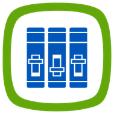

## Why do I need an API Gateway?

An API gateway provides a single, unified entry point across one or more internal APIs. It is an important element in any microservice architecture.

  

## Why Tree Gateway?

Tree Gateway is a free and open source solution writen in Node JS that has a complete and customizable pipeline to handle your requests.
It provides:

|Tree Gateway  | Features |
| --| --| 
|  **Authentication** | More than **300 strategies** available to authenticate your users through an easy [passportjs](http://passportjs.org/) integration, including support to **JWT tokens**, **Oauth**, **Basic** and many **others**. Custom strategies can also be writen directly in Javascript.|
|   **Routing** | A flexible and robust **Routing system** that allows any kind onf customized request pipeline. A plugable engine allow any kind of transformations or verifications to your API requests.| 
|   **Rate Limits** | To control **quotas** for your customers and to define actions to be taken when any quota is exceeded (And again, all customizations can be written as simple javascript functions).| 
|   **Caching** | Allow you to easily inject and control caching behavior for your APIs. Tree Gateway provides two kinds of cache:    - At **browser** level: Intercepting the responses and controling HTTP headers.   - At a **server** level - Caching your APIs responses in memory (using **redis**).| 
|   **Circuit Breaker** | A fast [circuitbreaker](https://martinfowler.com/bliki/CircuitBreaker.html) to **fast fail** your responses when your API is having problems to work. It support custom handlers for events like "open" or "close" circuit.| 
|   **Monitoring and Analytics** | Real Time **Monitoring and Analytics**. Allow you to collect statistics and monitor the state of your APIs and receive notifications about any problem.|
|   **Administration** | The gateway can be **configured remotelly**. **No restart** is needed. Any API configuration can be "hot" changed and all configurations are propagated to other tree-gateway cluster nodes with no pain. The gateway can be configured through:   - Admin API - A **REST API** that can be invoked through HTTP;  - SDK - **A Node JS SDK**;   - CLI - A **command line** tool.|
|   **Performance** |  Focused on **Performance** and **High Availability**. Tree Gateway turns easy the creation of big clusters.   - Support clusters of redis to share configurations, circuitbreaker states, cached content and so on.   - Automatically propagate events to all cluster nodes.   - Auto discovery for cluster nodes.   - Very low resources footprint.|

## Try Tree Gateway

Take a better look into Tree Gateway by checking out the project and working with it guided by our [Docs](https://github.com/Leanty/tree-gateway/wiki).